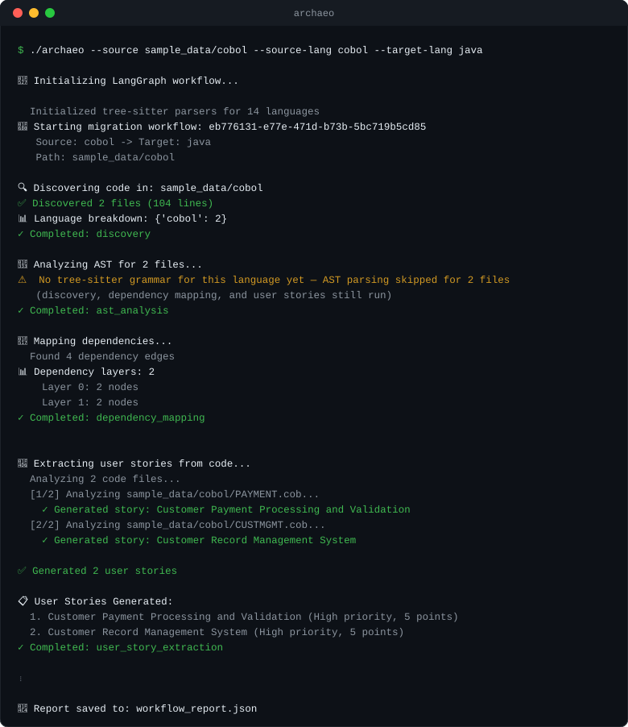

# archaeocode

[](https://github.com/osick/archaeocode/actions/workflows/ci.yml)
[](LICENSE)
[](https://www.python.org/downloads/)

**Automated software archaeology.** Point archaeocode at a legacy codebase — get back business-readable user stories, a dependency map, and structural analysis: the raw material for a migration backlog, excavated from code whose authors are long gone.

Most reverse-engineering tools stop at syntax: they parse code and draw diagrams. This project goes one step further and recovers the *business intent* hidden in legacy code. An AI agent workflow (LangGraph) orchestrates static-analysis tools (exposed as MCP servers) to turn COBOL, Smalltalk, Fortran, Pascal, or Java code into artifacts that stakeholders can actually read — the raw material for a migration backlog.

## What makes it different

- **User stories from code** — the unique feature: an LLM analyzes each source file and produces user stories with roles, capabilities, benefits, acceptance criteria, priority, and confidence scores. Legacy knowledge becomes a product backlog.
- **Legacy-first language support** — COBOL, Fortran, Pascal, and Smalltalk alongside Java, Python, JavaScript, and TypeScript. See the [language matrix](#language-support) for per-language capabilities.
- **Knowledge management built in** — every run can be persisted into a [GraphRAG knowledge base](docs/KNOWLEDGE_MANAGEMENT.md) (powered by [LightRAG](https://github.com/HKUDS/LightRAG)): files, entities, dependency edges and user stories become a queryable knowledge graph, exportable as an Obsidian-style wiki. Ask it questions with `archaeo-kb` or from any agent via MCP. Runs on local files or on Neo4j / Postgres / Qdrant for large estates.
- **MCP architecture** — analysis tools (AST parsing, dependency graphs, RAG, knowledge base) are [Model Context Protocol](https://modelcontextprotocol.io/) servers, so any MCP-capable agent can reuse them independently of this workflow.
- **Observable by design** — every workflow run can be traced in [LangSmith](https://docs.smith.langchain.com) (token costs, latency, state snapshots).

## How it works

```
LangGraph Orchestration
    │
[Discovery] ──► [AST Analysis] ──► [Dependency Mapping] ──► [User Stories] ──► [Knowledge Base]
    │                │                     │                     │                   │
file catalog    tree-sitter          graph + cycle          Claude / GPT      LightRAG GraphRAG
                  parsing              detection                              (optional, --knowledge-base)
```

Each analysis step is an MCP server under `src/mcp_servers/` (static analysis, graph DB, RAG pipeline, knowledge base); the LangGraph workflow under `src/orchestration/` wires them together with checkpointing and state management.

## Quick start

```bash
git clone https://github.com/osick/archaeocode.git
cd archaeocode
pip install -r requirements.txt

# Optional: install the `archaeo` command onto your PATH
pip install -e .

# Optional but recommended: enable user-story extraction
cp .env.example .env   # add your ANTHROPIC_API_KEY (or OPENAI_API_KEY)
```

Run the workflow against the bundled samples:

```bash
# COBOL analysis
python archaeo --source sample_data/cobol --source-lang cobol --target-lang java

# Java (Spring) analysis with report
python archaeo --source sample_data/java --source-lang java --target-lang python --report report.json
```



You get a console summary plus a JSON report: file catalog, language breakdown, dependency edges/cycles/layers, and (with an API key) generated user stories.

Keep the knowledge instead of just reporting it:

```bash
# persist the run into the knowledge base (+ an Obsidian-compatible wiki)
python archaeo --source sample_data/cobol --source-lang cobol --knowledge-base --kb-wiki ./wiki

# then ask it questions (query needs an LLM key; retrieve/graph/stats do not)
archaeo-kb query "Which programs touch the customer master file?"
archaeo-kb retrieve "PAYMENT" --mode local
archaeo-kb graph "PAYMENT.cob"
```

See [docs/KNOWLEDGE_MANAGEMENT.md](docs/KNOWLEDGE_MANAGEMENT.md) for the design decision (GraphRAG via LightRAG), query modes, and how to scale it to Neo4j / Postgres / Qdrant.

Or use it from Python:

```python
from src.orchestration.graph import create_graph

graph = create_graph()
result = graph.run(
    source_language="java",
    target_language="python",
    source_path="./sample_data/java",
)

print(result["total_files"], "files analyzed")
for story in result["user_stories"]:
    print("-", story["title"])
```

A complete runnable example is in [`examples/user_story_extraction/basic_usage.py`](examples/user_story_extraction/basic_usage.py).

## Feature status

| Feature | Status |
|---|---|
| Code discovery & cataloging (10+ languages) | ✅ working |
| AST parsing via tree-sitter (MCP server) | ✅ working |
| Dependency mapping, cycle detection, layering | ✅ working |
| AI user-story extraction (Claude / GPT) | ✅ working |
| LangSmith tracing | ✅ working |
| Checkpointing / resumable workflows | ✅ working |
| Smalltalk grammars (standard + Cincom) | ✅ working (grammar build required, see below) |
| Knowledge base: GraphRAG over files, entities, dependencies, stories (LightRAG, MCP server, `archaeo-kb`) | ✅ working (opt-in per run) |
| Knowledge base: LLM extraction of business entities | ✅ working (`--kb-extract`, needs API key) |
| Knowledge base: Obsidian-compatible wiki export | ✅ working |
| RAG semantic code search (MCP server) | 🚧 mock; superseded by the knowledge base |
| Neo4j-backed dependency graphs | 🚧 in-memory fallback works; live Neo4j optional (the knowledge base can use Neo4j today) |
| Code generation to target language | 🎯 planned |
| HP NonStop COBOL extensions (TMF, Pathway) | 🎯 planned |

## Requirements

- Python 3.10+
- An Anthropic or OpenAI API key for user-story extraction (everything else runs without one)
- Optional: Neo4j 5.x / PostgreSQL+pgvector / Qdrant to scale the knowledge base beyond local files, LangSmith account for tracing

## Language support

| Language | Discovery & catalog | Dependency map | User stories | AST parsing (tree-sitter) |
|---|:---:|:---:|:---:|:---:|
| COBOL | ✅ | ✅ | ✅ | 🎯 planned |
| Fortran | ✅ | ✅ | ✅ | 🎯 planned |
| Pascal | ✅ | ✅ | ✅ | 🎯 planned |
| Smalltalk (standard + Cincom) | ✅ | ✅ | ✅ | ✅ ¹ |
| Java | ✅ | ✅ | ✅ | ✅ |
| Python | ✅ | ✅ | ✅ | ✅ |
| JavaScript / TypeScript | ✅ | ✅ | ✅ | ✅ |

The AST MCP server additionally parses C, C++, C#, Go, Rust, Ruby, PHP, and Bash. Every language ships with a sample under [`sample_data/`](sample_data/) so you can try it immediately.

¹ Smalltalk uses custom tree-sitter grammars — build them once with `python scripts/build_smalltalk_grammar.py` (details: [SMALLTALK_SUPPORT](docs/SMALLTALK_SUPPORT.md), [SMALLTALK_VARIANTS](docs/SMALLTALK_VARIANTS.md)).

## Project structure

```
├── archaeo                     # CLI entry point (archaeo-kb: knowledge base CLI)
├── src/
│   ├── orchestration/          # LangGraph workflow
│   │   ├── graph.py            # Direct workflow (in-process nodes)
│   │   ├── graph_mcp.py        # MCP-backed workflow
│   │   ├── kb_cli.py           # archaeo-kb: query the knowledge base
│   │   ├── nodes/              # Discovery, AST, dependency, user-story, knowledge-base nodes
│   │   ├── state/              # Workflow state schema
│   │   └── utils/              # MCP client, LangSmith tracing
│   ├── mcp_servers/
│   │   ├── static_analysis/    # tree-sitter AST analysis + custom grammars
│   │   ├── graph_db/           # dependency graph (Neo4j / in-memory)
│   │   ├── rag_pipeline/       # chunking, embeddings, semantic search
│   │   └── knowledge_base/     # GraphRAG knowledge base (LightRAG adapter + MCP server)
│   └── parsers/                # language-specific parser extensions
├── config/                     # workflow + MCP server configuration
├── sample_data/                # COBOL, Java, Smalltalk, Fortran, Pascal, Python samples
├── tests/                      # pytest suite (runs in CI)
├── examples/                   # runnable usage examples
└── docs/                       # architecture & guides
```

## Testing

```bash
pip install pytest pytest-asyncio
pytest
```

The suite runs in [GitHub Actions](.github/workflows/ci.yml) on Python 3.10–3.12. Smalltalk tests are skipped automatically unless the grammar has been built.

## Documentation

- [Quick Start](QUICKSTART.md)
- [Architecture wireframe](docs/LANGGRAPH_WIREFRAME.md)
- [MCP server architecture](docs/MCP_ARCHITECTURE.md) and [usage](docs/MCP_SERVERS_USAGE.md)
- [LangSmith setup](docs/LANGSMITH_SETUP.md)
- [User story extraction](docs/USER_STORIES.md)
- [Knowledge management (GraphRAG knowledge base)](docs/KNOWLEDGE_MANAGEMENT.md)
- [Roadmap](docs/ROADMAP.md) · [Changelog](docs/CHANGELOG.md)

## Contributing

Issues and pull requests are welcome. Please run `pytest` before submitting, and open an issue first for larger changes.

## License

[MIT](LICENSE) © 2026 Oliver Sick

The bundled [Spring PetClinic sample](sample_data/spring-petclinic/) is third-party code from [spring-projects/spring-petclinic](https://github.com/spring-projects/spring-petclinic), redistributed under its own [Apache License 2.0](sample_data/spring-petclinic/LICENSE).
