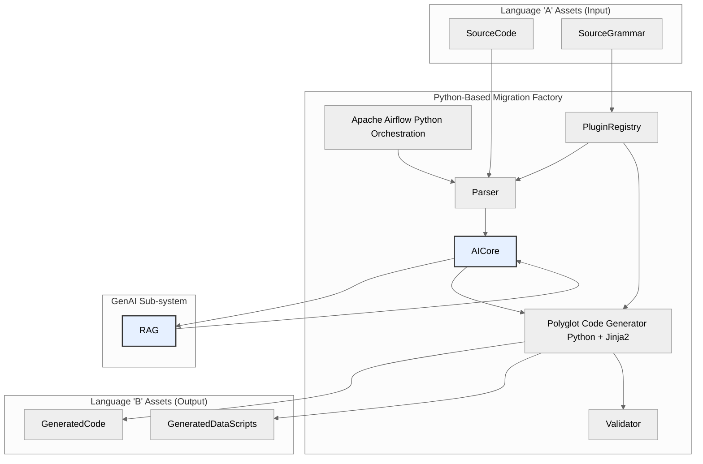
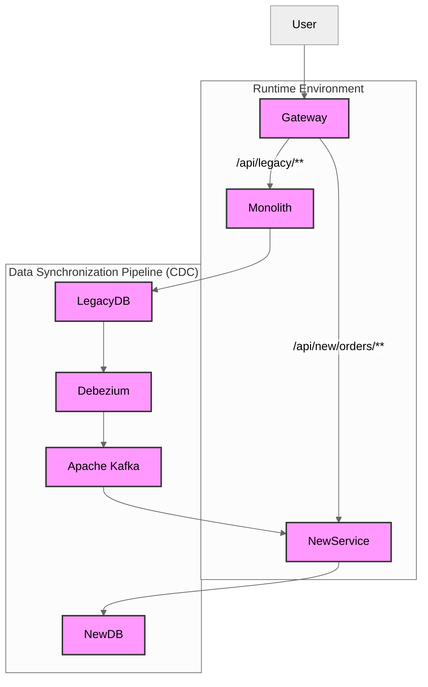
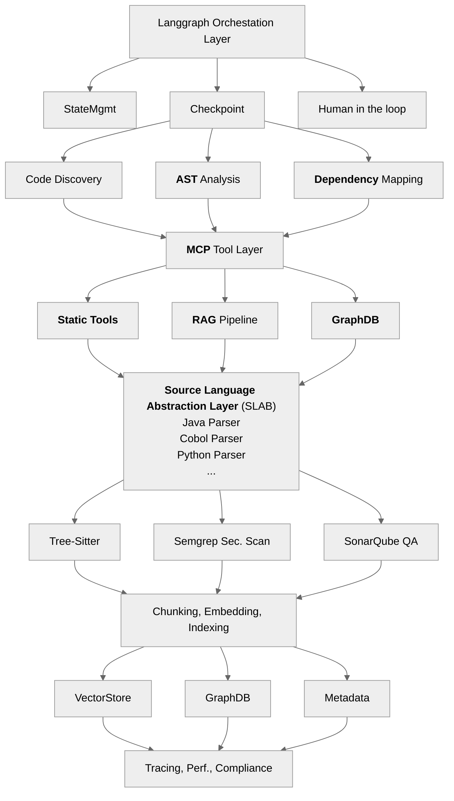
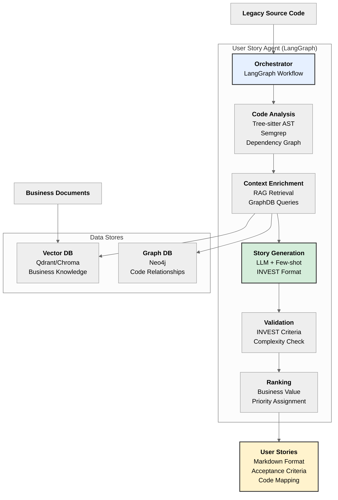

## Strategic Modernization Frameworks (The 7 R's)


| Strategy  | Primary Goal  | Risk / Effort Level   | Key GenAI Applicability |
|---        |---            |---                    |---                      |
| Rehost | "Speed |  Cost Savings (Infrastructure)" | Low / Low | Low: Minimal code interaction. GenAI may assist in infrastructure-as-code (IaC) generation. |
| Replatform | "Cloud Optimization |  Agility" | Low / Medium | Low: GenAI can help identify and update deprecated code or configs for PaaS compatibility. |
| Repurchase | "Shift to SaaS |  Reduce Maintenance" | Medium / Medium | "Medium: GenAI can assist in data migration mapping |  new workflow design |  and integration logic." |
| Refactor | "Improve Code Quality |  Reduce Tech Debt" | Medium / High | "High: GenAI is ideal for code explanation |  documentation |  test generation |  and suggesting refactoring patterns." |
| Rearchitect | "Architectural Agility (e.g. |  Microservices)" | High / High | "Very High: GenAI assists in analysis |  domain identification |  dependency mapping |  and test suite generation." |
| Rebuild | "Cloud-Native |  Full Modernization" | Very High / Very High | "Very High: GenAI acts as a co-pilot for generating new code |  tests |  and documentation from scratch. |


## The strangler Fig Pattern


### Strategic Framework: The Strangler Fig Runtime
Before using the factory, a strategic runtime architecture is required. The Strangler Fig pattern  is the most effective and lowest-risk methodology for this. This pattern is not built in Python, but it is the "scaffolding" that the Python factory builds for.   

* Facade: An API Gateway (e.g., Tyk, Kong) is placed in front of the monolith, intercepting all requests.   


* Identify & Build: The Python factory (Section 1) is used to analyze, translate, and generate a new microservice for a single piece of functionality (e.g., "orders") in the target language (e.g., Java).   


* Siphon Traffic: The API Gateway is reconfigured to route traffic for /api/orders to the new Java microservice, while all other traffic continues to go to the monolith.   


* Data Sync: A Change Data Capture (CDC) pipeline is established to keep data consistent. A tool like Debezium reads the legacy database's transaction logs (from DB2, Oracle, etc.)  and streams all changes to Apache Kafka. The new Java service consumes these events  to update its own modern database.   


* Repeat: This process is repeated, module by module, until the monolith is "strangled" and can be safely decommissioned.   

Architectural Diagram 2: The Runtime "Strangler Fig" Architecture
Note: The components below are the runtime system. Generative AI is not used here. GenAI (from Diagram 1) is a development-time tool used to build the "New Microservice (B)" component.




### How does strangler fig pattern with ui fat clients (three tier) ?


The solution is to apply the Strangler Fig pattern at the middle-tier (the application server), not the UI tier.

Here is the concrete implementation plan for this scenario.

The Two-Phase Strangle: Server-Side First, Then Client-Side
You must break the migration into two distinct, sequential phases:

1. Phase 1: Strangle the Application Server (Tier 2)

2. Phase 2: Strangle the Fat Client (Tier 1)

#### Phase 1: Strangle the Application Server (Tier 2)
During this phase, the fat client UI (Tier 1) remains completely unchanged. It continues to think it is talking to the original monolithic application server.

1. Introduce a "Strangler Facade"
Instead of an API Gateway (which is for HTTP), you introduce a protocol-aware Strangler Facade. This facade is a new, lightweight server that you place on the network in front of the legacy application server.   

    * Action: You will update your network configuration (e.g., DNS, or client-side config files) so that the fat client now points to this new facade instead of the old server.

    * Technology: This facade must be able to speak the exact same protocol as the monolith. If the client uses Java RMI, the facade must be a Java RMI server. If it uses a custom binary protocol, the facade must be able to parse it.

    * Function: Initially, this facade does nothing but pass 100% of the incoming calls directly to the legacy monolith.   

2. Identify and Build the First New Service
Using the Python-based "Migration Factory" from the report, you identify a single piece of business logic (e.g., calculateQuote) to extract from the monolith. The factory generates this as a new, independent microservice (e.g., a Java/Spring Boot or Kotlin/Ktor service).

3. Siphon Traffic at the Facade
This is the "strangulation" step. You update the logic inside the Strangler Facade:

    * When a call for getLegacyFeature() comes in from the fat client, the facade passes it through to the monolith.

    * When a call for calculateQuote() comes in, the facade intercepts it. It does not send it to the monolith.   

    * Instead, the facade translates this call into a modern request (e.g., a REST or gRPC call) to the new microservice.

    * When the microservice responds, the facade translates the response back into the old protocol (e.g., an RMI object) and sends it to the fat client.

To the fat client, nothing has changed. It sent an RMI request and got an RMI response. It is completely unaware that the logic was executed by a modern microservice.

4. The Role of Change Data Capture (CDC)
During this entire process, the new calculateQuote microservice and the old monolith must co-exist. The CDC pipeline (Debezium + Kafka) described in the report is still essential. It ensures that if the monolith updates a customer record, the new microservice sees that change, and vice versa.   

You repeat this process—build, deploy, and siphon—for every function until the legacy application server is nothing but an empty shell, and the Strangler Facade routes 100% of the logic to new microservices.

#### Phase 2: Strangle the Fat Client (Tier 1)
At the end of Phase 1, you have a new problem: a legacy fat client UI talking to a modern, microservice-based backend. Now, you can finally modernize the UI.

The strategy here is to embed a modern web UI inside the fat client.

1. Introduce a Webview Component: Almost all fat client technologies have a modern "webview" component (e.g., JavaFX WebView for Java Swing, or WebView2 for.NET WinForms/WPF). You add this component to your fat client application.

2. Identify a UI Module: You target one screen or even one tab of your fat client UI (e.g., the "Quote" screen).

3. Build a New Web UI: Using modern web technologies (like React or Angular, which can be generated by your factory's TypeScript templates), you build a new, web-based "Quote" screen. This new web UI directly calls the new microservices, bypassing the old facade.

4. Embed and Replace: You modify the fat client's code. When a user clicks the "Quotes" tab, instead of loading the old, native screen, the application loads the new web-based screen inside the webview component.

The user is still inside the familiar desktop application, but one piece of it is now a modern web app. You repeat this, replacing screen by screen, "strangling" the fat client from the inside out until the entire application is just a thin shell hosting a modern web application.

At that point, you can finally decommission the fat client shell and have users access the application directly in their browser.


# Langgraph Approach

## LangGraph Architecture for Reverse Engineering (Claude Approach)



## LangGraph Static Tool Stack 
    ┌─────────────────────────────────────────────────────────────────┐
    │                   LangGraph Static Tool Stack                   │
    ├─────────────────────────────────────────────────────────────────┤
    │                                                                 │
    │  1. tree-sitter (AST Parsing)                                   │
    │     ├─ Language-agnostic parser                                 │
    │     ├─ Support: 40+ languages                                   │
    │     └─ Used by: Aider, Continue.dev                             │
    │                                                                 │
    │  2. Universal Ctags (Code Indexing)                             │
    │     ├─ Function/class extraction                                │
    │     ├─ Support: 150+ languages                                  │
    │     └─ Integration: Code map generation                         │
    │                                                                 │
    │  3. Semgrep (Security Analysis)                                 │
    │     ├─ 5,000+ security rules                                    │
    │     ├─ Pattern matching                                         │
    │     └─ MCP server available                                     │
    │                                                                 │
    │  4. Graph Databases (Dependency Tracking)                       │
    │     ├─ Neo4j: Cypher queries                                    │
    │     ├─ Memgraph: High-performance                               │
    │     └─ Property graphs for relationships                        │
    │                                                                 │
    │  5. Vector Databases (Semantic Search)                          │
    │     ├─ Qdrant: Rust-based, high performance                     │
    │     ├─ Weaviate: Hybrid search                                  │
    │     ├─ Chroma: Embedded option                                  │
    │     └─ Pinecone: Managed service                                │
    │                                                                 │
    │  6. LangChain Document Loaders                                  │
    │     ├─ 100+ document formats                                    │
    │     ├─ RecursiveCharacterTextSplitter                           │
    │     └─ Function-boundary aware chunking                         │
    │                                                                 │
    └─────────────────────────────────────────────────────────────────┘


##   LangGraph: LangSmith Platform
    ┌─────────────────────────────────────────────────────────────────┐
    │                    LangSmith Architecture                       │
    ├─────────────────────────────────────────────────────────────────┤
    │                                                                 │
    │  Data Stores:                                                   │
    │  ├─ ClickHouse: High-volume trace storage                       │
    │  ├─ PostgreSQL: Metadata and relationships                      │
    │  ├─ Redis: Caching and queueing                                 │
    │  └─ Blob Storage: S3/GCS/Azure for sensitive data               │
    │                                                                 │
    │  Security & Compliance:                                         │
    │  ├─ SOC 2 Type II (July 2024)                                   │
    │  ├─ GDPR compliant (EU infrastructure: eu.smith.langchain.com)  │
    │  ├─ HIPAA with BAAs (Enterprise tier)                           │
    │  ├─ TLS encryption for all API calls                            │
    │  ├─ Database at-rest encryption                                 │
    │  └─ PII masking (collaboration with Ally Financial)             │
    │                                                                 │
    │  Capabilities:                                                  │
    │  ├─ Trace every LLM call with full context                      │
    │  ├─ Token usage and cost tracking                               │
    │  ├─ Latency analysis per graph node                             │
    │  ├─ Error tracking with stack traces                            │
    │  ├─ A/B testing for prompt variations                           │
    │  └─ Real-time monitoring dashboard                              │
    │                                                                 │
    │  Deployment Options:                                            │
    │  ├─ Cloud SaaS: smith.langchain.com                             │
    │  ├─ EU Cloud: eu.smith.langchain.com                            │
    │  └─ Self-hosted: Kubernetes + Helm charts                       │
    │                                                                 │
    └─────────────────────────────────────────────────────────────────┘

## Langgraph Decision
    ├───────────────────────────────────────────────────────────────────────────┤
    │  ✓ Need deterministic, reproducible workflows                            │
    │  ✓ Performance is critical (40-60% faster execution)                     │
    │  ✓ Token cost optimization important (30-50% reduction)                  │
    │  ✓ Complex multi-step orchestration required                             │
    │  ✓ Cloud-agnostic deployment needed                                      │
    │  ✓ Best debuggability and observability required                         │
    │  ✓ Analyzing 100K+ line codebases with state management                  │
    │  ✓ Need checkpoint-based recovery for long-running tasks                 │
    │  ✓ Want MCP-native architecture for future-proofing                      │
    │  ✓ Prefer Python ecosystem                                               |
    ├───────────────────────────────────────────────────────────────────────────┤


# Cincom Smalltalk and HPNonstop Cobol Migration

You have two complex migration scenarios that require significant additions to the base AST/SLAB framework:


## COBOL Migration:

Scenario 1: HP NonStop COBOL → Java
Challenge Level: ⚠️⚠️⚠️⚠️⚠️ (Very High)

* Not just COBOL, but entire **fault-tolerant platform**
* Mission-critical systems


**Standard**

        ┌────────────────────┐
        │  Parse COBOL       │
        │  ↓                 │
        │  Translate to Java │
        │  ↓                 │
        │  Done ✓            │
        └────────────────────┘

**NonStop COBOL Migration**

        ┌─────────────────────────────────────┐
        │  Parse NonStop COBOL extensions     │
        │  ↓                                  │
        │  Extract TMF transactions           │
        │  ↓                                  │
        │  Map Enscribe to RDBMS              │
        │  ↓                                  │
        │  Analyze process pairs              │
        │  ↓                                  │
        │  Translate Pathway to microservices │
        │  ↓                                  │
        │  Migrate SCREEN UI to web           │
        │  ↓                                  │
        │  Map TAL integration                │
        │  ↓                                  │
        │  Translate to Java + infrastructure │
        │  ↓                                  │
        │  Deploy with fault tolerance        │
        └─────────────────────────────────────┘

### Cobol Architecture: Base + Extensions

    ┌─────────────────────────────────────────────────────────────────┐
    │                  LangGraph Orchestration                        │
    │              (Your custom migration logic)                      │
    └─────────────────────────────────────────────────────────────────┘
                                  │
                    ┌─────────────┴─────────────┐
                    │                           │
            ┌───────▼────────┐         ┌───────▼────────┐
            │  Base MCP      │         │  Extension MCP │
            │  Servers       │         │  Servers       │
            │                │         │                │
            │  • tree-sitter │         │  NonStop:      │
            │  • Semgrep     │         │  • COBOL ext   │
            │  • SCIP        │         │  • TMF         │
            │  • Universal   │         │  • Pathway     │
            │    AST         │         │  • Enscribe    │
            │                │         │                │
            │                │         │  Smalltalk:    │
            │                │         │  • Image       │
            │                │         │  • Type infer  │
            │                │         │  • Translator  │
            └────────────────┘         └────────────────┘
                    │                           │
                    └───────────┬───────────────┘
                                ▼
                        ┌──────────────────┐
                        │  Target Platform │
                        │  • Spring Boot   │
                        │  • PostgreSQL    │
                        │  • React/Angular │
                        │  • Kubernetes    │
                        └──────────────────┘


## Cincom Smalltalk: Paradigm, Not Just Syntax

Scenario 2: Cincom Smalltalk → Java/Kotlin
Challenge Level: ⚠️⚠️⚠️⚠️⚠️ (Very High)

* **Paradigm mismatch** (dynamic → static, message passing → method calls)
* Image-based development (binary, not source files)


- Standard Migration:

        ┌────────────────────┐
        │  Parse source      │
        │  ↓                 │
        │  Translate         │
        │  ↓                 │
        │  Done ✓            │
        └────────────────────┘

- Smalltalk Migration:

        ┌─────────────────────────────────────┐
        │  Extract from binary image          │
        │  ↓                                  │
        │  Parse Smalltalk (different syntax) │
        │  ↓                                  │
        │  Infer static types (was dynamic)   │
        │  ↓                                  │
        │  Map blocks to lambdas              │
        │  ↓                                  │
        │  Translate collections to Streams   │
        │  ↓                                  │
        │  Handle metaprogramming             │
        │  ↓                                  │
        │  Rewrite UI (VisualWorks → React)   │
        │  ↓                                  │
        │  Generate typed Java/Kotlin         │
        └─────────────────────────────────────┘

# Sources

## Repos
* [tree-sitter](https://github.com/tree-sitter/tree-sitter)
* [tree-sitter-smalltalk](https://github.com/tom95/tree-sitter-smalltalk)
* [code-graph-rag](https://github.com/vitali87/code-graph-rag)
* [microsoft/graphrag](https://github.com/microsoft/graphrag)

## Other 2025
* [Legacy System Modernization and Migration: Strategies, Process, Services and Cost](https://www.bitcot.com/legacy-system-modernization-and-migration/)
* [Reverse Engineering User Stories from Code using Large Language Models](https://arxiv.org/abs/2509.19587)

## Other 2024
* [Unraveling the Potential of Large Language Models in Code Translation: How Far Are We?](https://arxiv.org/pdf/2410.09812v1)

## Other 2020-2023

## Other before 2020
* [apart Framework: Porting from VisualWorks](https://www.slideshare.net/slideshow/apart-framework-porting-from-visualworks/143194747)


# User Story Agent

## Overview

The **User Story Agent** is a specialized LangGraph-based component that extracts user stories from legacy source code. This agent supports the reverse engineering process by automatically generating business requirements documentation from existing code.

## Architecture Integration



## Key Features

✅ **Multi-language Support**: Via Tree-sitter (40+ languages including COBOL, Smalltalk)  
✅ **Context-aware**: RAG integration for business knowledge  
✅ **Relationship Mapping**: GraphDB queries for code dependencies  
✅ **INVEST Validation**: Ensures stories follow best practices  
✅ **Human-in-the-Loop**: Optional review checkpoints  
✅ **Research-backed**: Based on arxiv:2509.19587 (0.8 F1 score)

## Workflow Steps

1. **Code Discovery & Analysis**
   - Tree-sitter AST parsing
   - Function/class extraction
   - Complexity metrics (NLOC, cyclomatic)

2. **Context Enrichment**
   - RAG retrieval: Business docs, requirements, domain knowledge
   - GraphDB queries: Code relationships, dependencies
   - Similar stories: Past user stories for reference

3. **Story Generation**
   - LLM-based generation with few-shot prompting
   - INVEST format: Role, Capability, Benefit
   - Acceptance criteria: Given-When-Then scenarios

4. **Validation**
   - INVEST criteria checking
   - Complexity assessment
   - Dependency analysis

5. **Ranking & Prioritization**
   - Business value scoring
   - Complexity estimation (Fibonacci scale)
   - Risk assessment

## User Story Format

```markdown
As a [user role],
I want to [capability/feature],
So that [business value/benefit].

Acceptance Criteria:
- Given [context]
  When [action]
  Then [outcome]

Code Mapping:
- Files: [list]
- Functions: [list]
- Complexity: [NLOC, cyclomatic]
- Dependencies: [list]
```

## Integration with Existing Stack

The User Story Agent leverages existing components:

- **Tree-sitter**: Multi-language AST parsing
- **Semgrep**: Security and pattern analysis
- **RAG Pipeline**: Business context retrieval
- **GraphDB (Neo4j)**: Code relationship queries
- **LangSmith**: Observability and tracing

## Research Foundation

Based on **"Reverse Engineering User Stories from Code using Large Language Models"** (September 2025, arxiv:2509.19587):

- **F1 Score**: 0.8 for code up to 200 NLOC
- **Few-shot Learning**: Single example enables 8B models to match 70B models
- **Validation**: Tested on 1,750 C++ code snippets

## Usage Example

```python
from user_story_agent import UserStoryAgent, AgentConfig
from user_story_agent.tools.rag_retriever import RAGRetriever

# Configure
config = AgentConfig()
llm = config.get_llm()
rag = RAGRetriever()

# Create agent
agent = UserStoryAgent(llm=llm, rag_retriever=rag)
agent.compile()

# Extract user stories
stories = agent.run(
    source_files=["src/payment/processor.py"],
    business_context="E-commerce payment system"
)

# Output
for story in stories:
    print(story.to_markdown())
```

## Implementation Location

📁 `/user-story-agent/` - Complete implementation with:
- `agents/` - LangGraph orchestrator
- `models/` - State and data models
- `tools/` - Code analyzer, RAG retriever
- `prompts/` - LLM prompts
- `examples/` - Usage examples
- `README.md` - Full documentation

## Performance Characteristics

| Code Size (NLOC) | F1 Score | Model Size | Recommendation |
|------------------|----------|------------|----------------|
| < 50             | 0.92     | 8B         | Excellent      |
| 50-200           | 0.80     | 8B/70B     | Optimal        |
| 200-500          | 0.65     | 70B        | Use chunking   |
| > 500            | 0.50     | 70B        | Split files    |

**Best Practice**: Keep code chunks under 200 NLOC for optimal results.

## Reference Implementations

1. **arxiv:2509.19587** - User story extraction research (Sept 2025)
2. **code-graph-rag** (GitHub: vitali87/code-graph-rag) - Code knowledge graphs
3. **Microsoft GraphRAG** (GitHub: microsoft/graphrag) - Entity extraction
4. **LangGraph** - Agentic workflow orchestration

