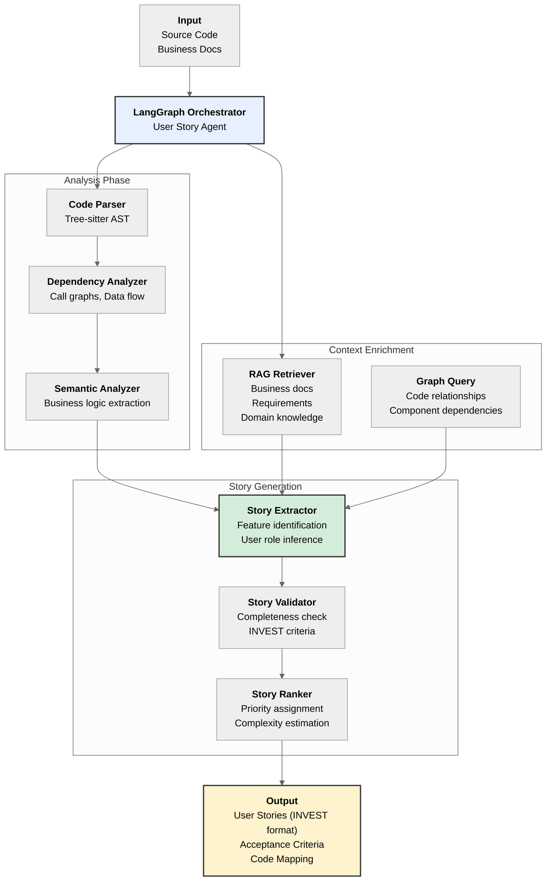

# User Story Agent Design

## Overview

The User Story Agent extracts user stories from legacy source code by analyzing code structure, behavior, and business context stored in RAG (vector database) and GraphDB. This design is based on the September 2025 research "Reverse Engineering User Stories from Code using Large Language Models" (arxiv:2509.19587).

## Architecture



## Key Research Findings (arxiv:2509.19587)

The 2025 research demonstrated that:
- LLMs achieve **F1 score of 0.8** for code up to 200 NLOC (non-comment lines of code)
- **Few-shot learning** (single example) enables 8B models to match 70B model performance
- User stories should follow **INVEST criteria**: Independent, Negotiable, Valuable, Estimable, Small, Testable

## User Story Agent Components

### 1. Code Analysis Layer

**Purpose**: Extract structural and semantic information from source code

**Tools**:
- **Tree-sitter**: Language-agnostic AST parsing
- **Universal Ctags**: Function/class indexing
- **Semgrep**: Pattern matching for business logic

**Output**:
```json
{
  "functions": [...],
  "classes": [...],
  "business_logic": [...],
  "data_flows": [...],
  "entry_points": [...]
}
```

### 2. Context Enrichment Layer

**Purpose**: Augment code analysis with business context

**Sources**:
- **Vector DB (RAG)**:
  - Historical requirements documents
  - Business process descriptions
  - Domain glossaries
  - Previous user stories

- **Graph DB**:
  - Component dependencies
  - Feature relationships
  - Data entity relationships
  - User interaction flows

**Query Pattern**:
```cypher
// Find related business features
MATCH (code:Function)-[:IMPLEMENTS]->(feature:Feature)
WHERE code.name = $function_name
RETURN feature.description, feature.business_value
```

### 3. Story Generation Layer

**Purpose**: Generate well-formed user stories from enriched code analysis

**User Story Format** (INVEST):
```
As a [user role],
I want to [capability/feature],
So that [business value/benefit].

Acceptance Criteria:
- Given [context]
  When [action]
  Then [outcome]

Code Mapping:
- Files: [list]
- Functions: [list]
- Complexity: [estimate]
```

**Generation Strategy**:
1. **Identify user roles**: From UI entry points, API endpoints, or business docs
2. **Extract capabilities**: From function/class purposes and workflows
3. **Infer business value**: From comments, naming, and RAG context
4. **Generate acceptance criteria**: From test cases, validations, and edge cases

### 4. Validation & Ranking Layer

**INVEST Criteria Validation**:
- ✅ **Independent**: No cross-dependencies with other stories
- ✅ **Negotiable**: Flexible implementation approach
- ✅ **Valuable**: Clear business benefit
- ✅ **Estimable**: Complexity can be assessed
- ✅ **Small**: Fits in one sprint (configurable threshold)
- ✅ **Testable**: Acceptance criteria are verifiable

**Ranking Factors**:
1. Business value score (from RAG)
2. Code complexity (NLOC, cyclomatic complexity)
3. Dependency count
4. User impact (from usage analysis)

## Integration with Existing Architecture

The User Story Agent leverages your existing MCP-based architecture:

```
┌─────────────────────────────────────────────────────────────┐
│         LangGraph User Story Agent (New Component)          │
├─────────────────────────────────────────────────────────────┤
│                                                             │
│  Checkpoints:                                               │
│  ├─ Code Discovery        (existing MCP)                    │
│  ├─ AST Analysis          (existing MCP)                    │
│  ├─ Dependency Mapping    (existing MCP)                    │
│  ├─ Context Enrichment    (RAG + GraphDB)                   │
│  ├─ Story Extraction      (NEW - LLM-based)                 │
│  └─ Validation & Ranking  (NEW - LLM-based)                 │
│                                                             │
│  Human-in-the-Loop:                                         │
│  ├─ Review generated stories                                │
│  ├─ Provide business context                                │
│  └─ Approve/reject stories                                  │
│                                                             │
└─────────────────────────────────────────────────────────────┘
```

## Implementation Requirements

### Required Components

1. **LangGraph** (v0.2+)
   - State management for multi-step workflow
   - Checkpoint-based recovery
   - Human-in-the-loop support

2. **LangChain**
   - Document loaders for business docs
   - Vector store integration (Qdrant/Chroma)
   - LLM integration (Claude, GPT-4, Gemini)

3. **Code Analysis Stack** (existing)
   - Tree-sitter parsers
   - Universal Ctags
   - Semgrep rules

4. **Storage**
   - Vector DB: Qdrant, Weaviate, or Chroma
   - Graph DB: Neo4j or Memgraph
   - Metadata store: PostgreSQL

5. **LLM Provider**
   - Anthropic Claude (recommended for code understanding)
   - OpenAI GPT-4
   - Google Gemini

### Python Dependencies

```python
# Core orchestration
langgraph>=0.2.0
langchain>=0.3.0
langchain-anthropic>=0.2.0

# Code analysis
tree-sitter>=0.23.0
tree-sitter-language-pack>=0.1.0
pygments>=2.18.0

# Storage
qdrant-client>=1.11.0
neo4j>=5.25.0
psycopg2-binary>=2.9.9

# Utilities
pydantic>=2.9.0
python-dotenv>=1.0.1
tenacity>=9.0.0
```

## Workflow States

```python
from typing import TypedDict, List, Annotated
from langgraph.graph import add_messages

class UserStoryState(TypedDict):
    # Input
    source_files: List[str]
    business_context: str

    # Analysis results
    ast_data: dict
    dependencies: dict
    business_features: List[dict]

    # RAG context
    similar_stories: List[dict]
    domain_knowledge: str

    # Generated stories
    raw_stories: List[dict]
    validated_stories: List[dict]
    ranked_stories: List[dict]

    # Conversation history
    messages: Annotated[list, add_messages]

    # Control flow
    iteration: int
    human_feedback: str
```

## Example Output

```markdown
### User Story #1 - Payment Processing
**Priority**: High | **Complexity**: Medium (8 points) | **Confidence**: 0.87

As a **customer**,
I want to **securely process credit card payments**,
So that **I can complete my purchase without entering payment details multiple times**.

**Acceptance Criteria**:
- Given a valid credit card number
  When the user submits payment
  Then the transaction is processed through the payment gateway
  And the user receives a confirmation email

- Given an invalid credit card
  When the user submits payment
  Then an error message is displayed
  And the transaction is not processed

**Code Mapping**:
- Files:
  - `src/payment/payment_processor.java:45-120`
  - `src/payment/credit_card_validator.java:12-67`
- Functions:
  - `processPayment()`
  - `validateCreditCard()`
  - `sendConfirmationEmail()`
- Complexity: 89 NLOC, Cyclomatic: 12
- Dependencies: PaymentGatewayAPI, EmailService, Database

**Business Context** (from RAG):
Retrieved from: `requirements/payment-system-spec.pdf`
"The payment system must support PCI-DSS compliance and handle
transactions across multiple payment providers..."
```

## Reference Implementations

1. **code-graph-rag** (GitHub: vitali87/code-graph-rag)
   - Multi-language codebase analysis with knowledge graphs
   - Natural language querying of code structure

2. **Microsoft GraphRAG** (GitHub: microsoft/graphrag)
   - Hierarchical community detection
   - Entity and relationship extraction

3. **LangGraph Code Agent** (LangChain tutorials)
   - Self-correcting code generation
   - Multi-step reasoning with checkpoints

## Advantages of This Approach

1. **Accuracy**: 80% F1 score (per research) for code understanding
2. **Context-aware**: Leverages business docs via RAG
3. **Scalable**: Works with large codebases via chunking
4. **Auditable**: Code mapping provides traceability
5. **Iterative**: Human-in-the-loop for quality control
6. **Multi-language**: Tree-sitter supports 40+ languages

## Challenges & Mitigation

| Challenge | Mitigation |
|-----------|------------|
| Large files (>200 NLOC) | Chunk by function/class boundaries |
| Missing business context | Interactive prompts for domain experts |
| Ambiguous user roles | Infer from UI layers, API consumers |
| Cross-cutting concerns | Dependency graph analysis |
| Legacy code quality | Semantic analysis + heuristics |

## Next Steps

1. ✅ Design complete
2. ⏳ Implement basic LangGraph workflow
3. ⏳ Integrate with existing MCP servers
4. ⏳ Create example prompts and templates
5. ⏳ Build RAG pipeline for business docs
6. ⏳ Implement INVEST validation
7. ⏳ Add human-in-the-loop checkpoints
8. ⏳ Test with sample legacy codebase
